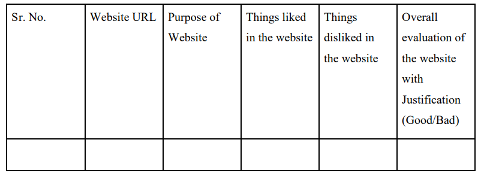

# Web-Technology
Codes done in practical sessions of Web Technology will be updated here.

Course Objectives:
1.To learn the concepts of HTML 5 for developing client side user interface
2.To learn the client side technologies for web development.
3. To reduce the amount of code for building rich user interface applications using AngularJS.
4.To build single-page web applications with ReactJS.
5.To learn the server side technologies for web development.
6.To build web applications quickly with less code using Spring Boot framework

Suggested List of Assignments
[ Students have to complete all the assignments towards the successful completion of Term Work, where all the implementation and design assignments are compulsory]

Group A
1. Case study: Before coding of the website, planning is important, students should visit different
websites (Min. 5) for the different client projects and note down the evaluation results for these
websites, either good website or bad website in following format: 

From the evaluation, students should learn and conclude different website design issues, which should be
considered while developing a website.

2. a. Installation and configuration of LAMP stack/Tomcat Server
 b. Design a static Web application using HTML 5 with all possible elements.

3. Apply CSS and Bootstrap on Assignment 2

4. Implement Registration and Login Authentication using Javascript.

5. Try making a to-do list app using AngularJs. The app should have the following features:
       
    1. A form which allows you to add a to-do item.
    2. A delete button that will allow you to delete a particular todo item
    3. An edit portion which will allow you to edit a particular to-do item.

6. Implement a web page index.htm for any client website (e.g., a restaurant website project) using the following:

   1.  HTML syntax: heading tags, basic tags and attributes, frames, tables, images, lists, links for text and images, forms etc.
   2. Use of Internal CSS, Inline CSS, External CSS and ReactJS.

7. Implement Database application using JSP/Servlet.

8. Build a dynamic web application using Spring boot and perform basic database operations.

9. Mini Project: Design and implement a dynamic web application for any business functionality using web development technologies that you have learnt in this course.
